# Introduction
- This is a tutorial walking you through the text analysis tool [Voyant](http://voyant-tools.org/). It is designed to help you work with various texts. This could be either your own text or an existing collection of texts already online. You can use plain text, HTML, XML, PDF, RTF, and MS Word documents in this tool. You can find out a variety of information about your texts by simply uploading your text to Voyant and using the useful tools it has! 

# Software & Setup
- Since this is a web-based tool, you do not need to download anything! Yipee! Simply go to the [Voyant Website](http://voyant-tools.org/) to begin. 
- You have many options for uploading your text to the website. You can copy and paste a text into the text box (or type something): 
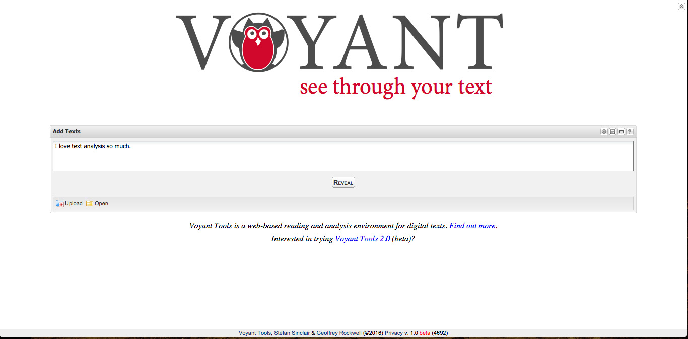
- OR you can upload a document from your computer: 

- Press "Upload" and then "Add" 
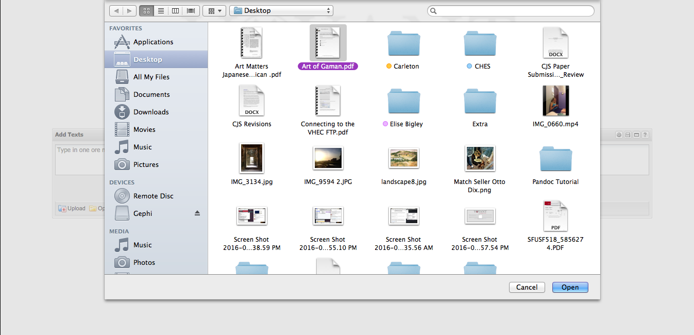
- Choose a file in your computer to upload and then press "Reveal" 
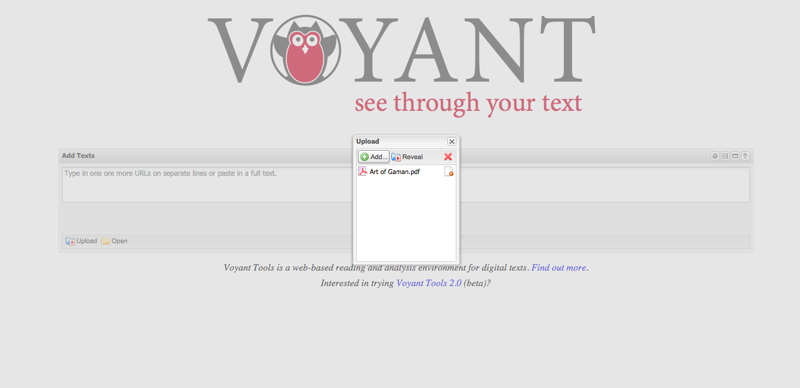
- If you don't have a file to upload, but still want to try out the tool, Voyant has two texts you can use to play around with the tool
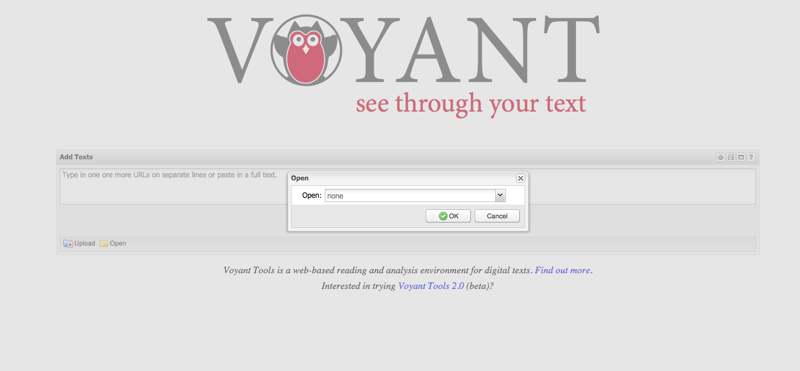
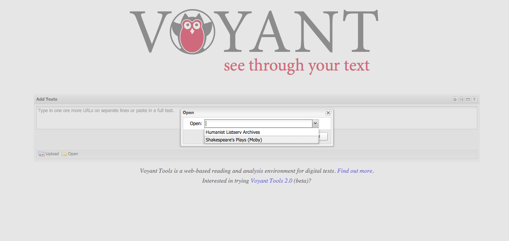

# Using the tool (it's fun!)
# Word Cloud Fun
- So I used an article called "The Art of Gaman: Arts and Crafts from the Japanese American Internment Camps, 1942–1946" by Bibliana Obler. Here's a link to the exhibit connected to this work at the [Smithsonian American Art Museum](http://americanart.si.edu/exhibitions/archive/2010/gaman/)
- When you press "Reveal" this screen should appear: 
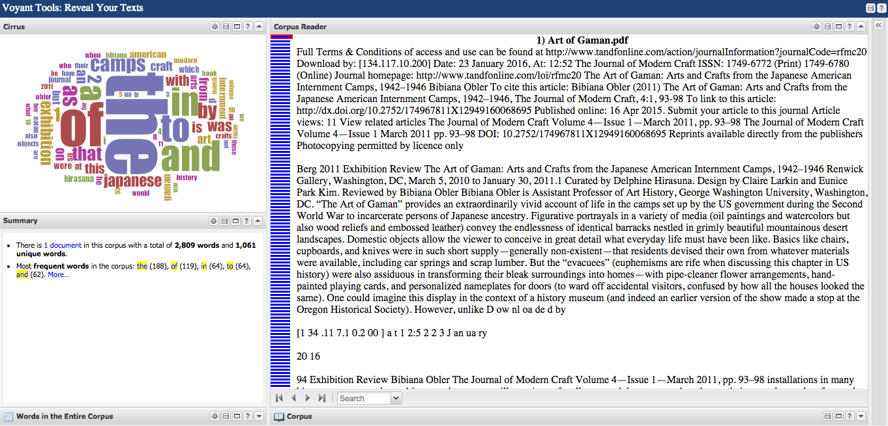
- If you notice the word cloud in the corner, in the section "Cirrus" the words "The, Of, A, To, In, And, As" are the largest words. In order to get rid of this go to the "Cirrus" section, click on the gear icon. An "Options" box will appear, go to the dropdown menu beside "Stop Words List" and select "English (Taporware)"
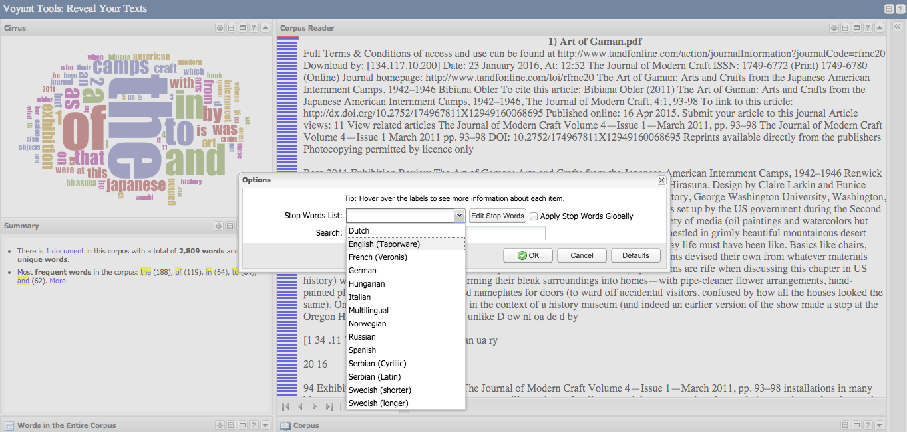
- When you follow this path you will find your word cloud reflects more accurately the frequent words and gives you a much better sense of the topic and themes present in the paper (without even reading it yet!). 
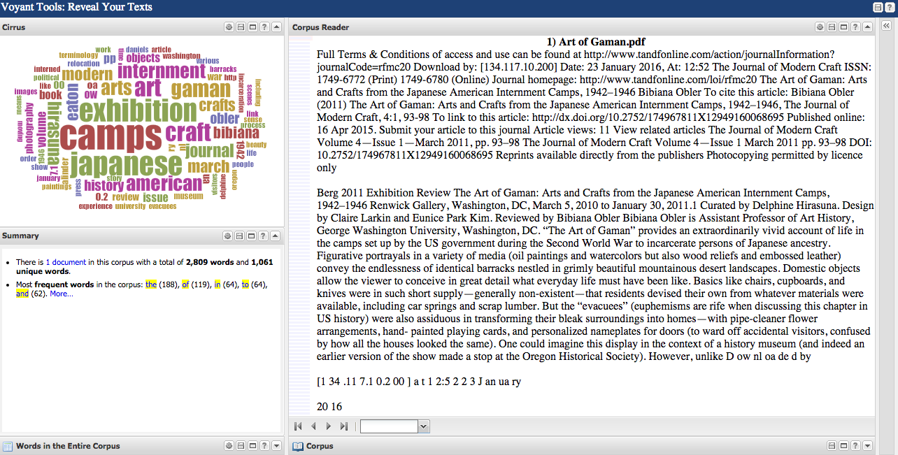 

# Word Search Fun 
- If you want to find if a word is in the text or how often it occurs in the text, you can do that easily by typing in the bottom left seach bar "Corpus Reader" section: 
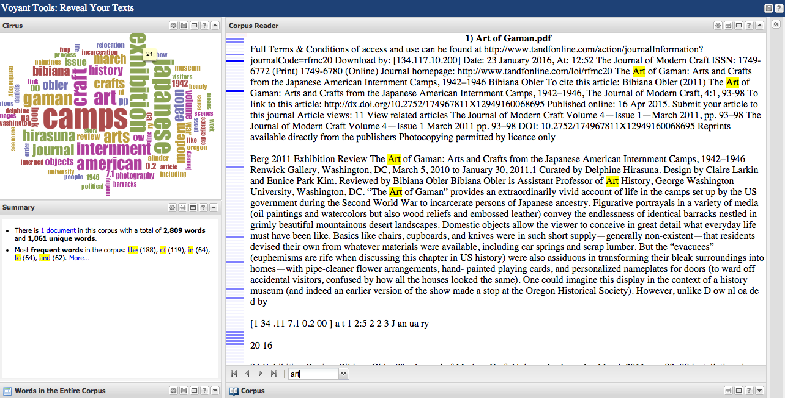 
I chose the word "Art" to search. Voyant highlights the search term, and on the left column there are blue markers. If you click on any of the markers it takes you to the page in which the term is located. 

# Word Trend Fun
- If you want a better visualization of where a word is in the document, I would recommend trying out what the "Word Trends" tool has to offer. It is located in the top right corner of the Voyant page. This section is hidden, so you'll need to click in the top right corner of the page on the "<<" button to show the "Word Trends" section: 
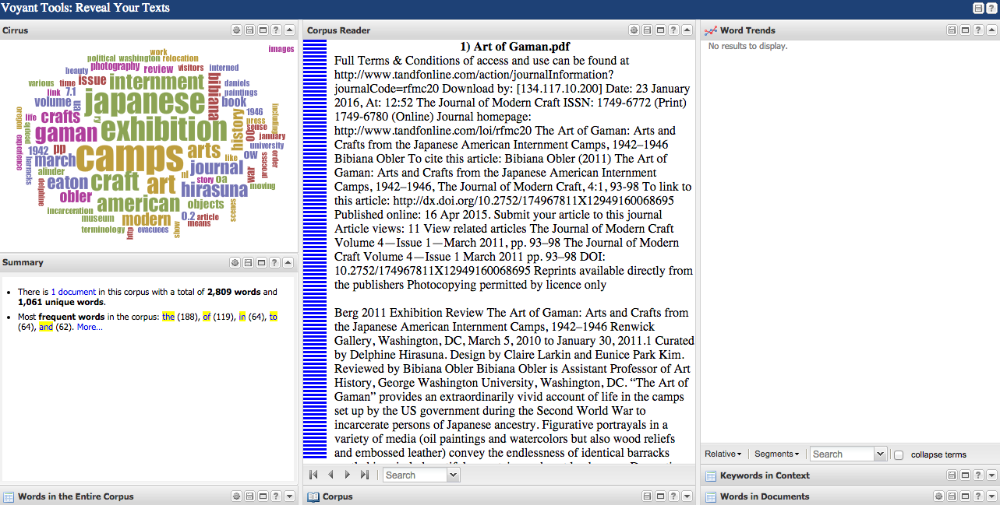 
- To plug a word into this tool type your word into the search bar in the bottom of the "Word Trends" section: 
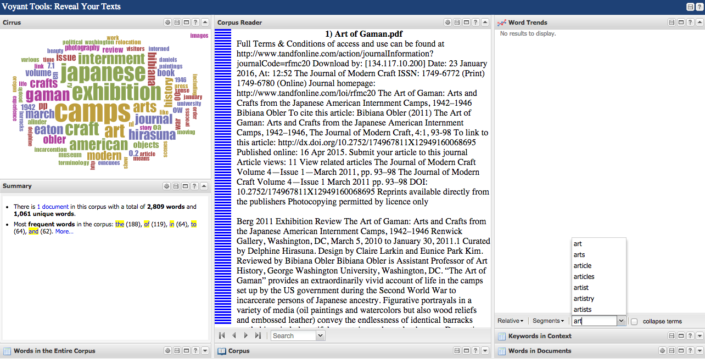
- Voyant will kindly list alternative words for your word search. Simply press enter when you've typed in your full word, and voila: 
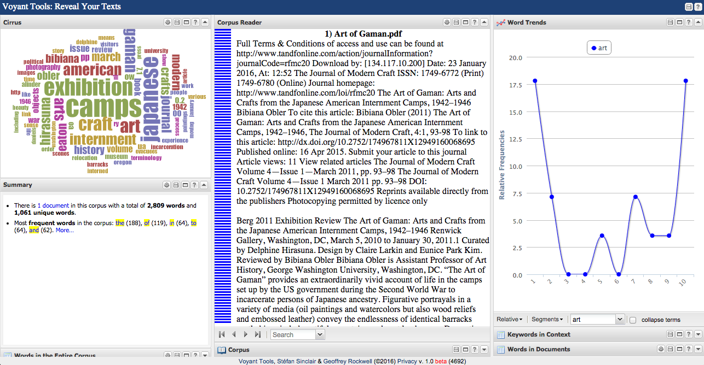 
- If you then wanted to compare the frequency of that word to another, say "Camp", you need only type in the new word in the search bar and press enter: 
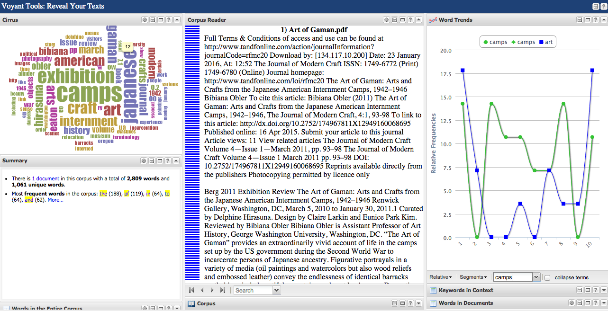 
- You can add more words to asses their frequency in comparison to other words, as well.

# Saving Fun 
- To save any of these documents, simply click on the "Save" icon in any of the sections. It will give you a lot of options for saving: 
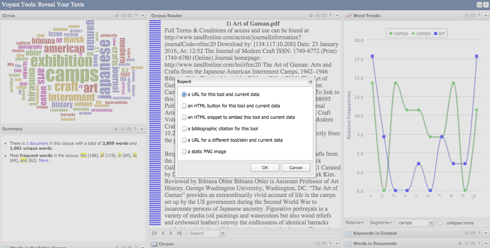 
- I usually save my text analysis visuals in a "a static PNG image"
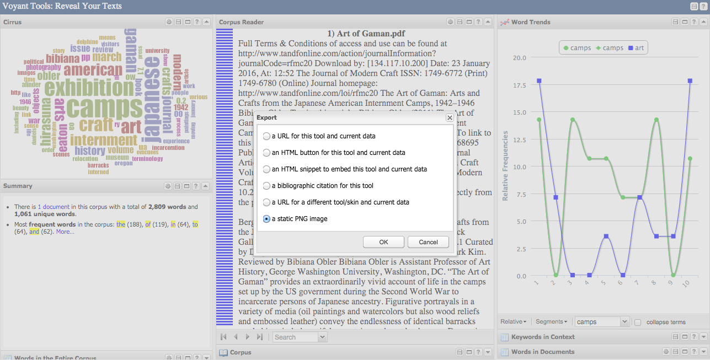

# Conclusion
- Overall, this is a very accesible web-based tool for text analysis. Voyant is easy to use and understand. It allows you to see your texts and documents in different visual capacities. It would be useful for things like resumes or term papers, to see if you repeated a word too often. This would result in a quick and easy fix. By visualizing where certain words are in a text, this can give you a sense of what subjects are talked about in those areas. 
- If you want a fuller discussion (and further examples of what this tool can show you) check out my [Text Analysis Assignment](https://github.com/elisebigley/text-analysis-assignment/blob/master/Text%20Analysis.md) 

